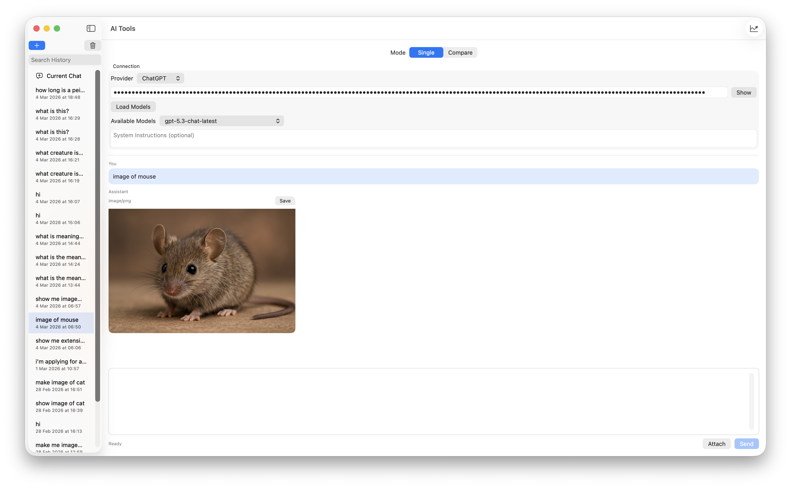

# AI Tools

A SwiftUI AI playground app for chatting with multiple providers from one interface.

## Screenshot



## Overview

AI Tools lets you:

- switch between Gemini, OpenAI, and Anthropic
- load available models from each provider
- keep local chat history with searchable conversations
- send prompts with optional file attachments
- view and save generated media (images, audio, video, PDF, text, JSON, CSV)

## Features

- Unified chat UI across providers
- Provider-specific API keys in Keychain
- Provider + selected model saved per conversation
- Conversation sidebar with new/delete/search
- Markdown rendering for assistant responses
- Cached model lists per provider (instant when switching chats/providers)
- Startup model prefetch for providers that already have API keys
- Attachment import with image preprocessing (center-crop to square, resize up to 1280x1280, JPEG encode)
- 18 MB attachment size limit per file
- Media output viewer with Save export flow
- Token usage + estimated cost summaries for session, last 24h, last 7d, and last 30d

## Provider Support

| Provider | Chat | Model List | Attachments | Media Output |
|---|---|---|---|---|
| Gemini | Yes | Yes | Yes | Yes |
| OpenAI | Yes | Yes | Not sent yet | Image generation models supported |
| Anthropic | Yes | Yes | Not sent yet | Text only |

Notes:

- OpenAI image generation is used automatically when an image model ID is selected (for example `gpt-image-*` or `dall-e-*`).
- For OpenAI and Anthropic, attachments are currently acknowledged in-chat but not uploaded to those APIs yet.

## Requirements

- Xcode 17+
- Apple platform SDKs supported by your local Xcode install
- Valid API key(s) for any provider you want to use

The current project settings in `AI Tools.xcodeproj` target the latest SDK versions configured in the project file.

## Getting Started

1. Clone this repository.
2. Open [AI Tools.xcodeproj](AI%20Tools.xcodeproj) in Xcode.
3. Select the `AI Tools` scheme.
4. Choose a run destination (for example `My Mac`).
5. Build and run.

CLI build example:

```bash
xcodebuild -project "AI Tools.xcodeproj" -scheme "AI Tools" -configuration Debug build
```

## Usage

1. Select a provider in the **Connection** section.
2. Paste the provider API key.
3. (Optional) Click **Load Models** to refresh provider models.
4. Choose a model from **Available Models**.
5. Model lists appear immediately from cache when switching chats/providers.
6. Add system instructions if needed.
7. Type a prompt, optionally attach files, then click **Send**.
8. Use the chat history sidebar to reopen prior conversations.
9. See rolling usage summaries (24h/7d/30d) near the composer footer.

## Data Storage

- API keys are stored securely in the system Keychain.
- Selected provider/model/system-instruction and model-list caches are stored locally using `@AppStorage` (UserDefaults).
- Conversations are stored locally with SwiftData.
- No server-side app backend is included in this project.

## Testing

This project includes unit tests for `PlaygroundViewModel`, including:

- cached models shown immediately when switching conversations/providers
- startup model prefetch behavior
- one-time launch prefetch guard
- rolling token/cost aggregation (24h/7d/30d), including legacy timestamp fallback and unsaved current-chat data

Run tests:

```bash
xcodebuild -project "AI Tools.xcodeproj" -scheme "AI Tools" -destination "platform=macOS" -configuration Debug CODE_SIGNING_ALLOWED=NO CODE_SIGNING_REQUIRED=NO test
```

## Project Structure

- [AI Tools/ContentView.swift](AI%20Tools/ContentView.swift): Main UI layout and interaction
- [AI Tools/ViewModels/PlaygroundViewModel.swift](AI%20Tools/ViewModels/PlaygroundViewModel.swift): App state, provider switching, send flow, conversation persistence
- [AI Tools/Models/ChatModels.swift](AI%20Tools/Models/ChatModels.swift): Core models and provider enums
- [AI Tools/Models/PendingAttachment.swift](AI%20Tools/Models/PendingAttachment.swift): Attachment loading and image preprocessing
- [AI Tools/Networking/GeminiClient.swift](AI%20Tools/Networking/GeminiClient.swift): Gemini API integration
- [AI Tools/Networking/OpenAIClient.swift](AI%20Tools/Networking/OpenAIClient.swift): OpenAI API integration
- [AI Tools/Networking/AnthropicClient.swift](AI%20Tools/Networking/AnthropicClient.swift): Anthropic API integration
- [AI Tools/Storage/ConversationStore.swift](AI%20Tools/Storage/ConversationStore.swift): SwiftData conversation persistence
- [AI Tools/Views/ChatRenderingViews.swift](AI%20Tools/Views/ChatRenderingViews.swift): Message/media rendering components
- [AI ToolsTests/PlaygroundViewModelTests.swift](AI%20ToolsTests/PlaygroundViewModelTests.swift): Model cache and prefetch unit tests

## Known Limitations

- OpenAI and Anthropic attachment upload is not implemented yet.

## License

[MIT](LICENSE)
